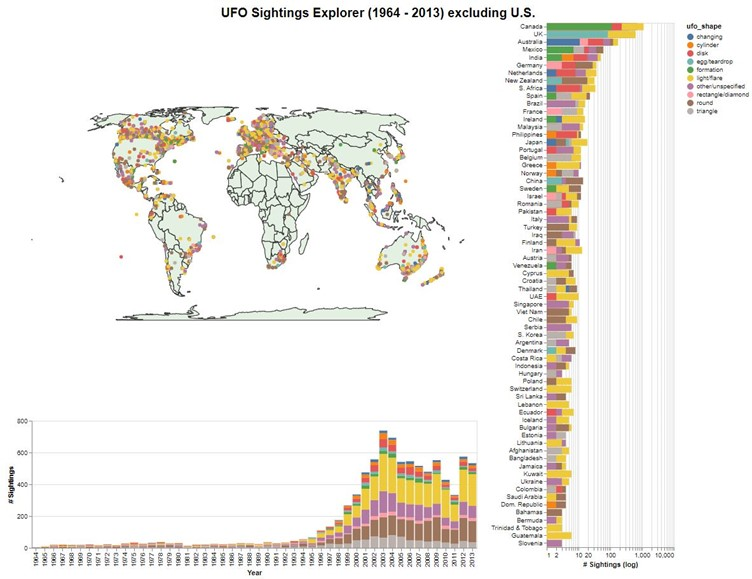

# ufo_sightings
Interactive Tool to Explore Global UFO Sightings from 1964 - 2013

<video width="630" height="300" src="demo_ufo_sightings_explore.mp4"></video>

<figure>
    
    <figcaption></figcaption>
</figure>

## Introduction
This project is to clean, analyse, and present findings on UFO Sightings around the world.
This tool is to allows the user to explore the relationship between the number of UFO sightings (excluding U.S.), 
the UFO shapes observed, the years they were sighted, and the country/state/geo-location of the sightings.

## Data
The initial dataset was UFO Sightings from the [2019 Tidy Tuesday Collection](https://github.com/rfordatascience/tidytuesday/blob/master/data/2019/2019-06-25/ufo_sightings.csv). The original
dataset had information about UFO sightings from 1906 to 2014. The features included: 
- Datetime
- City Area
- State
- Country
- UFO Shape
- Encounter Length
- Described Length
- Description of Encounter
- Date Documented
- Latitude
- Longitude 

Using Python/Jupyter Notebook I cleaned and carried out some data manipulation creating 
a new [dataset](https://raw.githubusercontent.com/21chubaka/ufo_sightings/main/cleaned_ufo_sightings_non_us_v2.csv).

## Data Manipulation
### Retrieved Countries that were null:
The original dataset had many countries that were null. I was able to retrieve almost all the 
null countries, as the City Area feature had the country also included.
Split Date Time to Month, Day, Year and Time Features:
This would make it easier to graph with these features as individual features.
### Dropped Null Countries/Ocean:
A few sightings were located in the middle of the ocean or in country-less areas, which did 
not easily fit into this specific analysis.
### Consolidated UFO Shapes:
Many of the shapes in the original dataset were extremely similar, resulting in 30 shapes. 
By consolidating the similar shapes, I was able to decrease the shapes to 10 shapes. This 
supported using Tableau10 palette which should be more distinguishable especially for 
those with colour-blindness.
### Excluded US Sightings:
The decision to exclude U.S. sightings had two purposes. The first was to look at sightings 
elsewhere in the world, as U.S. UFO sightings are extensively researched and documented. 
The second was U.S. sightings accounted for more than 70,000 rows, while the rest was 
around 10,000 rows. This made the data imbalanced. Also, the size of the dataset was 
making interactions significantly slow resulting in crashes and the U.S. was overplotted. 
Excluding these rows improved performance of the interactions greatly and avoiding using 
an imbalanced dataset.
### Excluded Countries with less than 10 sightings:
Over the years, countries that only had less than 10 sightings did not really make sense to 
keep. This was especially true as the number of sightings by country I used log to smooth 
out the data.

## Design Considerations
### Overall goal: 
The overall goal for this tool is to enable the user to explore the relationship 
between the number of UFO sightings (excluding U.S.), the UFO shapes observed, the years 
they were sighted, and the country/state/geo-location of the sightings.
### Transformations: 
The main transformation I used for this tool was to limit the data to show 
UFO sightings from 1964 to 2013. The choice of 1964 was made due to their being 
significantly lower number of sightings before that year. I decided to exclude 2014 as it was 
only data for half that year.
### World Map with Scatter Plot: 
This is a scatter plot of the location of UFO sightings on the 
world map. The colour of each point in the scatter plot represents the UFO shape observed.
The tooltip shows more details of each point’s city, country, and encounter length in 
seconds. Even though I excluded the U.S. based on the Country feature, some of the 
remaining non-U.S. latitude and longitudes still landed within the U.S. country on the map. 
This does raise the question if all the latitudes and longitudes are accurately recorded. I had 
considered doing a choropleth to color-code the map countries based on sighting 
frequency, but found that the latitude and longitude points were more interesting, and the 
points could be coloured by another feature – I chose UFO shape.
Initially, I considered making the size of the marks correspond to the encounter length. 
However, it already suffers from a bit of overplotting, and increasing the size of some dots 
would exacerbate the problem.
### Vertical Stacked Bar Chart: 
This stacked bar chart shows the log of the number of sightings 
by each country. The log of number of sightings was chosen to smooth the chart out, as the 
countries with the most sightings made the chart unreadable. The colours are the UFO 
shapes coinciding with the UFO shape legend. The colours are not able to represent the
stacking due to the values being log, but when the user filters the data with the legend of 
UFO shape the colour keeps consistent with the encoding across the other charts. The chart 
is sorted by number of sightings. The user can get a great reference of the countries with 
the most sightings and their ranking compared to each country represented. The tooltip 
shows the shape and actual count of sightings as opposed to the log of count of sightings for 
each country.
### Horizontal Stacked Bar Chart: 
This stacked bar chart shows the number of sightings by each 
year across 50 years from 1964 to 2013. The colours are the UFO shapes coinciding with the 
UFO shape legend. I initially was going to have years showed vertically, but since it is a time 
series it was determined that time is easier for the user to decipher horizontally. The tooltip 
shows the shape and actual count of sightings for each year.
### Interaction consideration: 
I used cross-filtering in this tool. Users can select subsets of the 
data on any of the charts and the rest of the charts will automatically filter. The world 
scatter plot uses an interval select brush to filter the user’s choice of UFO sightings. The 
vertical stacked bar chart uses a point select to filter by country(s) and the horizontal 
stacked bar chart uses an interval select brush to filter the user’s choice of year(s)